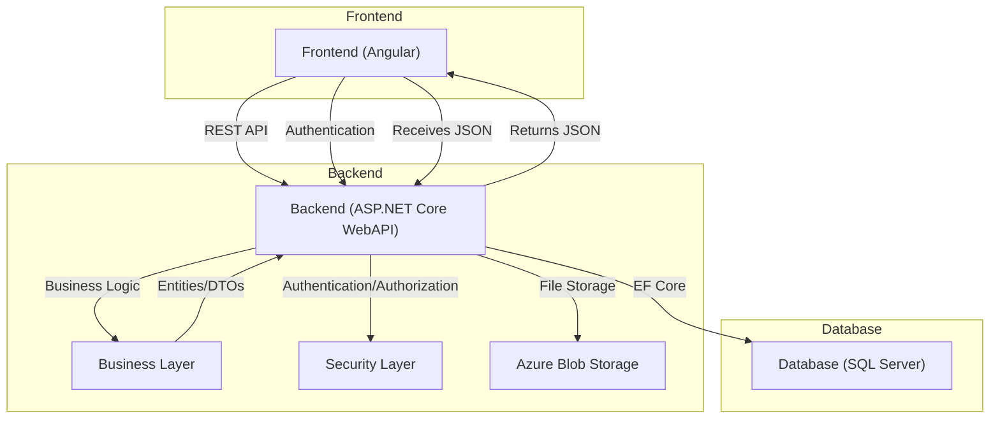
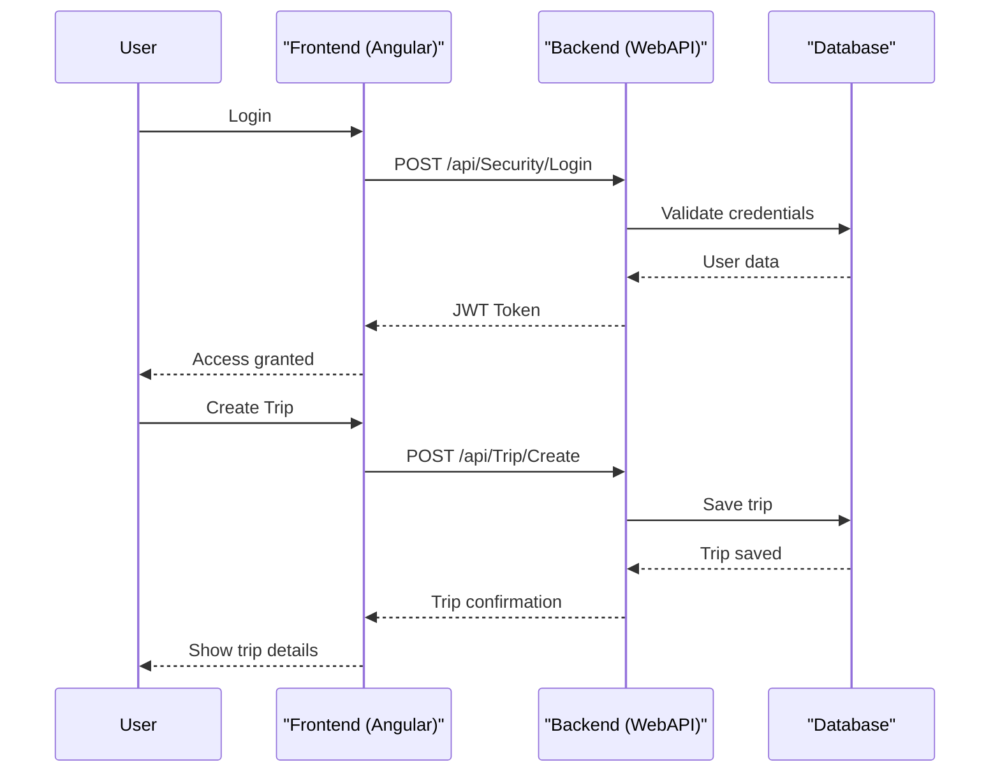
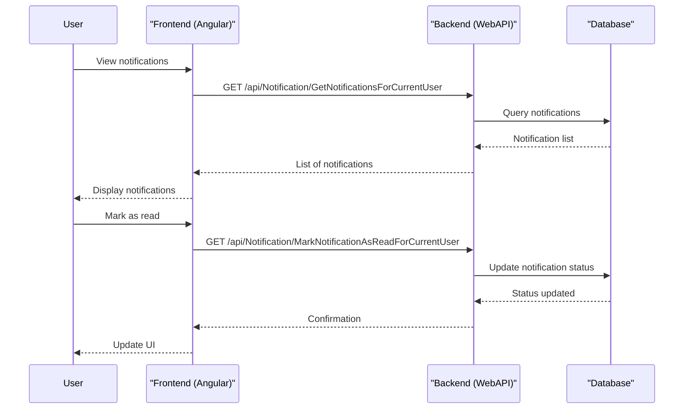
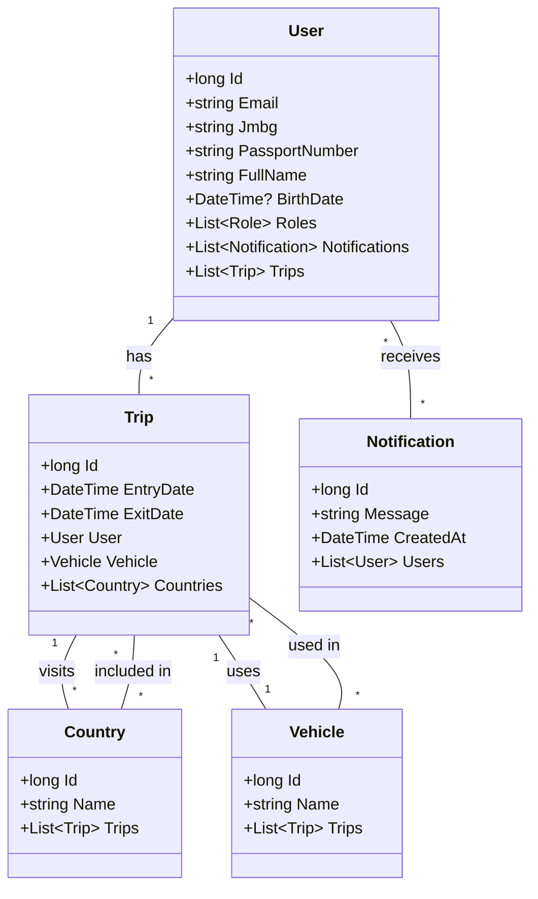

# Travel Agency Dokumentacija

## 1. Korisnički zahtev

Aplikacija omogućava korisnicima da upravljaju putovanjima, korisnicima, vozilima, državama i notifikacijama u okviru turističke agencije. Sistem podržava kreiranje, pregled, izmenu i brisanje putovanja, kao i upravljanje korisničkim nalozima i obaveštenjima.

## 2. Opis sistema

### 2.1 Opis slučajeva korišćenja

- **Kreiranje putovanja:** Korisnik unosi podatke o putovanju (datumi, vozilo, države) i sistem čuva putovanje u bazi.
- **Pregled i upravljanje korisnicima:** Administrator može pregledati, dodavati i brisati korisnike.
- **Pregled i upravljanje vozilima i državama:** Administrator može upravljati entitetima vozila i država.
- **Notifikacije:** Korisnici dobijaju i upravljaju notifikacijama (čitanje, označavanje kao pročitano/nepročitano).
- **Prijava i autentikacija:** Korisnici se prijavljuju putem email-a i lozinke, sistem koristi JWT autentikaciju.

### 2.2 Opis arhitekture aplikacije

Aplikacija je podeljena na frontend (Angular), backend (ASP.NET Core WebAPI) i bazu podataka (SQL Server). Backend koristi Entity Framework Core za pristup bazi i implementira poslovnu logiku i REST API. Frontend komunicira sa backend-om putem REST API-ja.

#### Dijagram komponenti



#### Povezivanje aplikacije i baze

Backend koristi Entity Framework Core za mapiranje entiteta na SQL Server bazu. Veza se konfiguriše u `Startup.cs` i koristi dependency injection za pristup kontekstu baze.

### 2.3 Opis procesa slučajeva korišćenja (dijagrami sekvenci)

#### Prijava korisnika i kreiranje putovanja



#### Upravljanje notifikacijama



### 2.4 Model podataka (dijagram klasa)



---

## 3. Detaljna specifikacija REST API-ja

> Sve dostupne metode i njihovu dokumentaciju možete pregledati automatski putem Swagger interfejsa na adresi `https://localhost:44388/swagger/index.html` nakon pokretanja backend-a.

### Primeri endpoint-a

#### UserController

- **GetCurrentUser**
  - **Opis:** Dohvata podatke o trenutno prijavljenom korisniku.
  - **Endpoint:** `/api/User/GetCurrentUser`
  - **Metoda:** GET
  - **Zaglavlja:** `Authorization: Bearer <JWT>`
  - **Parametri:** Nema
  - **Izlaz:** JSON objekat korisnika (UserDTO)

#### NotificationController

- **SendNotificationEmail**
  - **Opis:** Šalje email za određenu notifikaciju.
  - **Endpoint:** `/api/Notification/SendNotificationEmail`
  - **Metoda:** GET
  - **Zaglavlja:** `Authorization: Bearer <JWT>`
  - **Parametri:** `notificationId` (long), `notificationVersion` (int)
  - **Izlaz:** Status (void)

- **DeleteNotificationForCurrentUser**
  - **Opis:** Briše notifikaciju za trenutnog korisnika.
  - **Endpoint:** `/api/Notification/DeleteNotificationForCurrentUser`
  - **Metoda:** DELETE
  - **Zaglavlja:** `Authorization: Bearer <JWT>`
  - **Parametri:** `notificationId` (long), `notificationVersion` (int)
  - **Izlaz:** Status (void)

- **MarkNotificationAsReadForCurrentUser**
  - **Opis:** Označava notifikaciju kao pročitanu.
  - **Endpoint:** `/api/Notification/MarkNotificationAsReadForCurrentUser`
  - **Metoda:** GET
  - **Zaglavlja:** `Authorization: Bearer <JWT>`
  - **Parametri:** `notificationId` (long), `notificationVersion` (int)
  - **Izlaz:** Status (void)

- **GetUnreadNotificationsCountForCurrentUser**
  - **Opis:** Vraća broj nepročitanih notifikacija za trenutnog korisnika.
  - **Endpoint:** `/api/Notification/GetUnreadNotificationsCountForCurrentUser`
  - **Metoda:** GET
  - **Zaglavlja:** `Authorization: Bearer <JWT>`
  - **Parametri:** Nema
  - **Izlaz:** Broj (int)

- **GetNotificationsForCurrentUser**
  - **Opis:** Vraća listu notifikacija za trenutnog korisnika.
  - **Endpoint:** `/api/Notification/GetNotificationsForCurrentUser`
  - **Metoda:** POST
  - **Zaglavlja:** `Authorization: Bearer <JWT>`
  - **Parametri:** `filterDTO` (JSON)
  - **Izlaz:** Lista notifikacija (PaginatedResultDTO<NotificationDTO>)

---

## 4. Opis korišćenih tehnologija

- **Frontend:** Angular, PrimeNG, Transloco, TypeScript
- **Backend:** ASP.NET Core WebAPI, Entity Framework Core, LightInject, FluentValidation, Serilog
- **Baza:** SQL Server
- **Autentikacija:** JWT (JSON Web Token)
- **Ostalo:** Azure Blob Storage za fajlove, Swagger za API dokumentaciju

---

## 5. Korisničko uputstvo

1. **Pokretanje backend-a:**
   - Uđite u `Backend/TravelAgency.WebAPI` i pokrenite: `dotnet run`
   - API će biti dostupan na `http://localhost:5173/swagger`

2. **Pokretanje frontend-a:**
   - Uđite u `Frontend` i pokrenite: `npm install` zatim `npm start`
   - Aplikacija će biti dostupna na `http://localhost:4200/`

3. **Karakteristični slučajevi korišćenja:**
   - Prijavite se kao korisnik ili administrator.
   - Kreirajte novo putovanje, izaberite države i vozilo.
   - Pregledajte i upravljajte korisnicima, vozilima i državama.
   - Primajte i upravljajte notifikacijama.

---

## 6. Prikaz reprezentativnih delova koda

Primer Angular komponente za listu putovanja:
```typescript
export class TripListComponent implements OnInit {
    cols: Column<Trip>[];
    getPaginatedTripListObservableMethod = this.apiService.getPaginatedTripList;
    exportTripListToExcelObservableMethod = this.apiService.exportTripListToExcel;
    deleteTripObservableMethod = this.apiService.deleteTrip;
    // ...
}
```

Primer backend servisa za slanje notifikacije:
```csharp
public async Task SendNotificationEmail(long notificationId, int notificationVersion)
{
    await _travelAgencyBusinessService.SendNotificationEmail(notificationId, notificationVersion);
}
```

---

## 7. Link ka GitHub repozitorijumu

[GitHub Repository](https://github.com/filiptrivan/travel-agency)

---

## 8. Pokretanje projekta na lokalnoj mašini

1. Klonirajte repozitorijum:  
   `git clone https://github.com/filiptrivan/travel-agency.git`
2. Pokrenite backend (`dotnet run` u `Backend/TravelAgency.WebAPI`)
3. Pokrenite frontend (`npm install` i `npm start` u `Frontend`)
4. Pristupite aplikaciji na `http://localhost:4200/` i API-ju na `https://localhost:44388/swagger/index.html`
