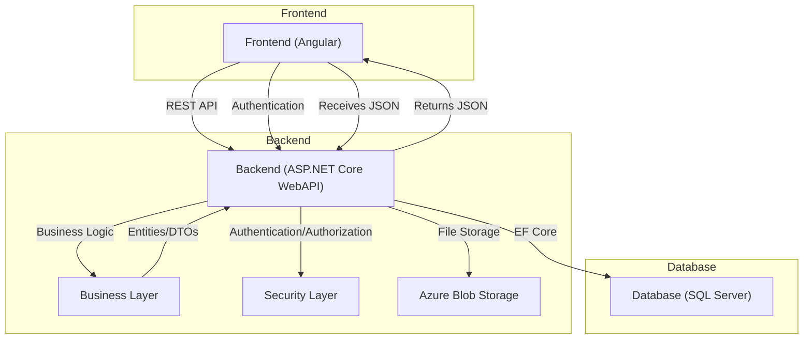
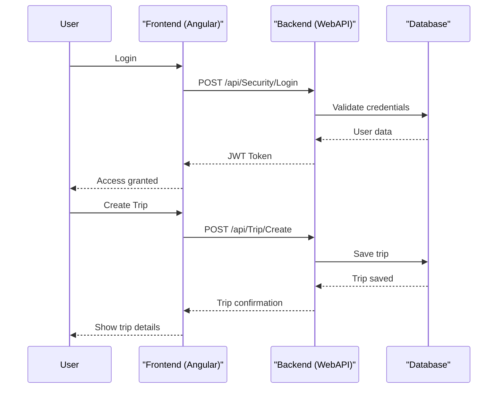
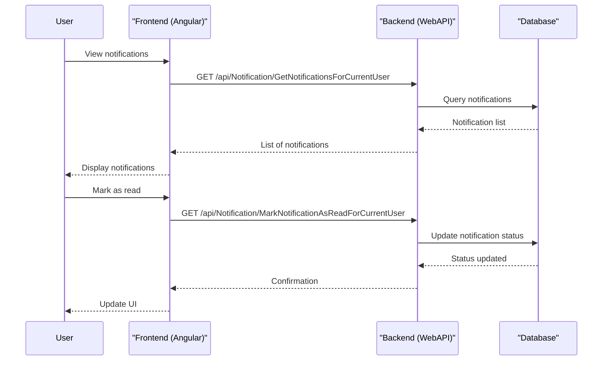
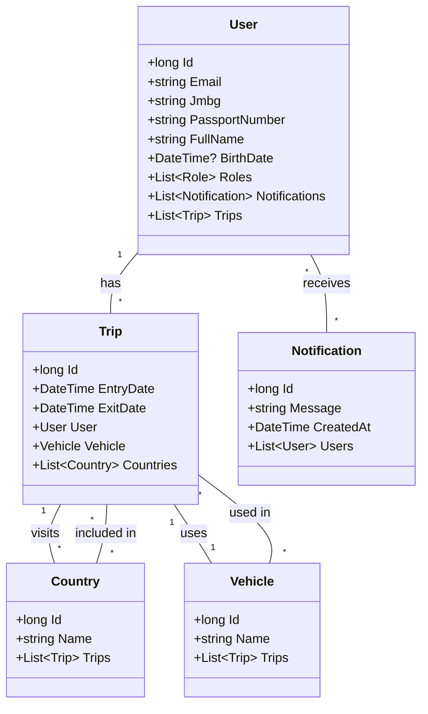

# Travel Agency Dokumentacija

## 1. Korisnički zahtev

Aplikacija omogućava korisnicima da upravljaju putovanjima, korisnicima, vozilima, državama i notifikacijama u okviru turističke agencije. Sistem podržava kreiranje, pregled, izmenu i brisanje putovanja, kao i upravljanje korisničkim nalozima i obaveštenjima.

## 2. Opis sistema

### 2.1 Opis slučajeva korišćenja

- **Kreiranje putovanja:** Korisnik unosi podatke o putovanju (datumi, vozilo, države) i sistem čuva putovanje u bazi.
- **Pregled i upravljanje korisnicima:** Administrator može pregledati, dodavati i brisati korisnike.
- **Pregled i upravljanje vozilima i državama:** Administrator može upravljati entitetima vozila i država.
- **Notifikacije:** Korisnici dobijaju i upravljaju notifikacijama (čitanje, označavanje kao pročitano/nepročitano).
- **Prijava i autentikacija:** Korisnici se prijavljuju putem email-a i lozinke, sistem koristi JWT autentikaciju.

### 2.2 Opis arhitekture aplikacije

Aplikacija je podeljena na frontend (Angular), backend (ASP.NET Core WebAPI) i bazu podataka (SQL Server). Backend koristi Entity Framework Core za pristup bazi i implementira poslovnu logiku i REST API. Frontend komunicira sa backend-om putem REST API-ja.

#### Dijagram komponenti



#### Povezivanje aplikacije i baze

Backend koristi Entity Framework Core za mapiranje entiteta na SQL Server bazu. Veza se konfiguriše u `Startup.cs` i koristi dependency injection za pristup kontekstu baze.

### 2.3 Opis procesa slučajeva korišćenja (dijagrami sekvenci)

#### Prijava korisnika i kreiranje putovanja



#### Upravljanje notifikacijama



### 2.4 Model podataka (dijagram klasa)



---

### 2.5 Detaljna specifikacija REST API-ja

> Sve dostupne metode i njihovu dokumentaciju možete pregledati automatski putem Swagger interfejsa na adresi `https://localhost:44388/swagger/index.html` nakon pokretanja backend-a.

### Primeri endpoint-a

#### UserController

- **GetCurrentUser**
  - **Opis:** Dohvata podatke o trenutno prijavljenom korisniku.
  - **Endpoint:** `/api/User/GetCurrentUser`
  - **Metoda:** GET
  - **Zaglavlja:** `Authorization: Bearer <JWT>`
  - **Parametri:** Nema
  - **Izlaz:** JSON objekat korisnika (UserDTO)

#### NotificationController

- **SendNotificationEmail**
  - **Opis:** Šalje email za određenu notifikaciju.
  - **Endpoint:** `/api/Notification/SendNotificationEmail`
  - **Metoda:** GET
  - **Zaglavlja:** `Authorization: Bearer <JWT>`
  - **Parametri:** `notificationId` (long), `notificationVersion` (int)
  - **Izlaz:** Status (void)

- **DeleteNotificationForCurrentUser**
  - **Opis:** Briše notifikaciju za trenutnog korisnika.
  - **Endpoint:** `/api/Notification/DeleteNotificationForCurrentUser`
  - **Metoda:** DELETE
  - **Zaglavlja:** `Authorization: Bearer <JWT>`
  - **Parametri:** `notificationId` (long), `notificationVersion` (int)
  - **Izlaz:** Status (void)

- **MarkNotificationAsReadForCurrentUser**
  - **Opis:** Označava notifikaciju kao pročitanu.
  - **Endpoint:** `/api/Notification/MarkNotificationAsReadForCurrentUser`
  - **Metoda:** GET
  - **Zaglavlja:** `Authorization: Bearer <JWT>`
  - **Parametri:** `notificationId` (long), `notificationVersion` (int)
  - **Izlaz:** Status (void)

- **GetUnreadNotificationsCountForCurrentUser**
  - **Opis:** Vraća broj nepročitanih notifikacija za trenutnog korisnika.
  - **Endpoint:** `/api/Notification/GetUnreadNotificationsCountForCurrentUser`
  - **Metoda:** GET
  - **Zaglavlja:** `Authorization: Bearer <JWT>`
  - **Parametri:** Nema
  - **Izlaz:** Broj (int)

- **GetNotificationsForCurrentUser**
  - **Opis:** Vraća listu notifikacija za trenutnog korisnika.
  - **Endpoint:** `/api/Notification/GetNotificationsForCurrentUser`
  - **Metoda:** POST
  - **Zaglavlja:** `Authorization: Bearer <JWT>`
  - **Parametri:** `filterDTO` (JSON)
  - **Izlaz:** Lista notifikacija (PaginatedResultDTO<NotificationDTO>)

---

## 3. Opis korišćenih tehnologija

- **Frontend:** Angular, PrimeNG, Transloco, TypeScript
- **Backend:** ASP.NET Core WebAPI, Entity Framework Core, LightInject, FluentValidation, Serilog
- **Baza:** SQL Server
- **Autentikacija:** JWT (JSON Web Token)
- **Ostalo:** Azure Blob Storage za fajlove, Swagger za API dokumentaciju

---

## 4. Korisničko uputstvo

1. **Pokretanje backend-a:**
   - Uđite u `Backend/TravelAgency.WebAPI` i pokrenite: `dotnet run`
   - API će biti dostupan na `https://localhost:44388/swagger/index.html`

2. **Pokretanje frontend-a:**
   - Uđite u `Frontend` i pokrenite: `npm install` zatim `npm start`
   - Aplikacija će biti dostupna na `http://localhost:4200/`

3. **Karakteristični slučajevi korišćenja:**
   - Prijavite se kao korisnik ili administrator.
   - Kreirajte novo putovanje, izaberite države i vozilo.
   - Pregledajte i upravljajte korisnicima, vozilima i državama.
   - Primajte i upravljajte notifikacijama.

---

## 5. Prikaz reprezentativnih delova koda

### Backend – Model, Servis i Kontroler

**Entitet User (model):**
```csharp
public class User : BusinessObject<long>, IUser
{
    [Required]
    public string Email { get; set; }
    public string Jmbg { get; set; }
    public string PassportNumber { get; set; }
    public string FullName { get; set; }
    public DateTime? BirthDate { get; set; }
    public virtual List<Role> Roles { get; } = new();
    public virtual List<Notification> Notifications { get; } = new();
    public virtual List<Trip> Trips { get; } = new();
}
```

**Primer poslovne logike (servis):**
```csharp
public async Task SendNotificationEmail(long notificationId, int notificationVersion)
{
    await _context.WithTransactionAsync(async () =>
    {
        await _authorizationService.AuthorizeAndThrowAsync<User>(BusinessPermissionCodes.UpdateNotification);
        Notification notification = await GetInstanceAsync<Notification, long>(notificationId, notificationVersion);
        List<string> recipients = notification.Recipients.Select(x => x.Email).ToList();
        await _emailingService.SendEmailAsync(recipients, notification.Title, notification.EmailBody);
    });
}
```

**Primer API kontrolera:**
```csharp
[HttpGet]
[AuthGuard]
public async Task<UserDTO> GetCurrentUser()
{
    long userId = _authenticationService.GetCurrentUserId();
    return await _travelAgencyBusinessService.GetUserDTO(userId, false);
}
```

---

### Frontend – Angular Komponenta i Servis

**Komponenta za prikaz korisnika:**
```typescript
export class UserListComponent implements OnInit {
    cols: Column<User>[];
    getPaginatedUserListObservableMethod = this.apiService.getPaginatedUserList;
    exportUserListToExcelObservableMethod = this.apiService.exportUserListToExcel;
    deleteUserObservableMethod = this.apiService.deleteUser;
    constructor(private apiService: ApiService, private translocoService: TranslocoService) { }
    ngOnInit(){
        this.cols = [
            {name: this.translocoService.translate('Email'), filterType: 'text', field: 'email'},
            {name: this.translocoService.translate('CreatedAt'), filterType: 'date', field: 'createdAt', showMatchModes: true},
            {actions:[
                {name: this.translocoService.translate('Details'), field: 'Details'},
                {name:  this.translocoService.translate('Delete'), field: 'Delete'},
            ]},
        ]
    }
}
```

**Primer frontend servisa za rad sa backend API-jem:**
```typescript
getPaginatedTripList = (filterDTO: Filter): Observable<PaginatedResult<Trip>> => { 
    return this.http.post<PaginatedResult<Trip>>(`${this.config.apiUrl}/Trip/GetPaginatedTripList`, filterDTO, this.config.httpSkipSpinnerOptions);
}
```

**Komponenta za rad sa notifikacijama:**
```typescript
export class NotificationsViewComponent implements OnInit {
  currentUserNotifications: PaginatedResult<Notification>;
  crudMenu: MenuItem[] = [];
  filter = new Filter<Notification>({ first: 0, rows: 10 });
  constructor(private apiService: ApiService, private translocoService: TranslocoService, private messageService: SpiderlyMessageService, private layoutService: LayoutService) {}
  ngOnInit() {
    this.crudMenu = [
      {label: this.translocoService.translate('Delete'), command: this.deleteNotificationForCurrentUser, icon: 'pi pi-trash'},
      {label: this.translocoService.translate('MarkAsRead'), command: this.markNotificationAsReadForCurrentUser, icon: 'pi pi-eye'},
      {label: this.translocoService.translate('MarkAsUnread'), command: this.markNotificationAsUnreadForCurrentUser, icon: 'pi pi-eye-slash'},
    ];
    this.getNotificationsForCurrentUser();
  }
  getNotificationsForCurrentUser(){
    this.apiService.getNotificationsForCurrentUser(this.filter).subscribe((notifications) => {
      this.currentUserNotifications = notifications;
    });
  }
}
```

---

## 6. Link ka GitHub repozitorijumu

[GitHub Repository](https://github.com/filiptrivan/travel-agency)